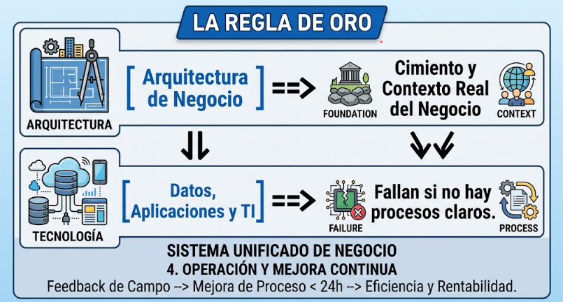
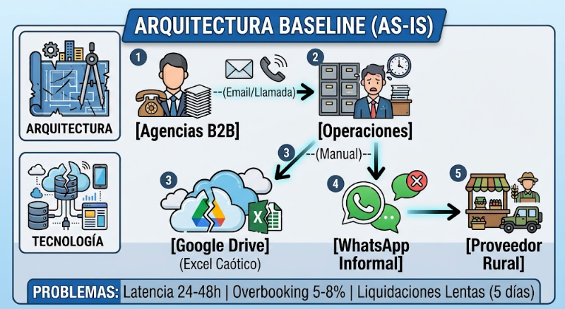
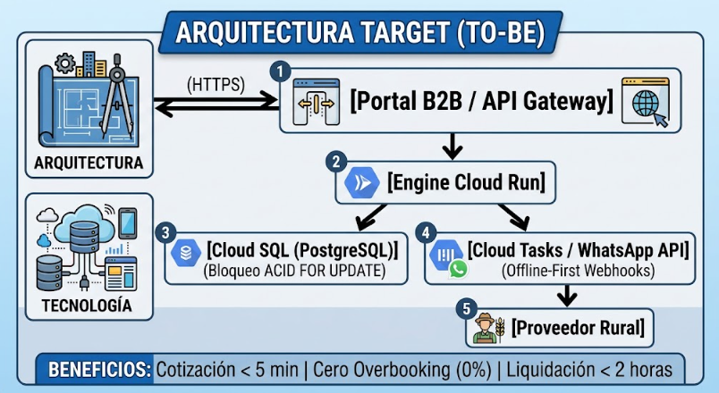
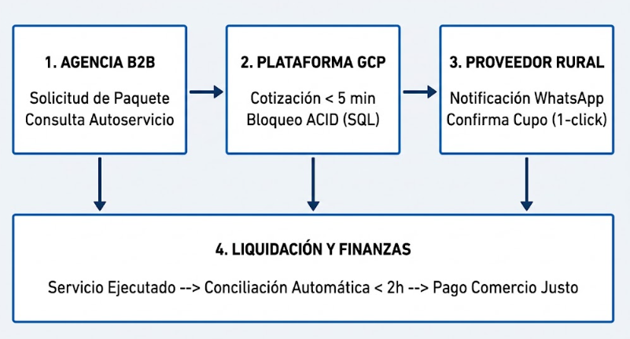
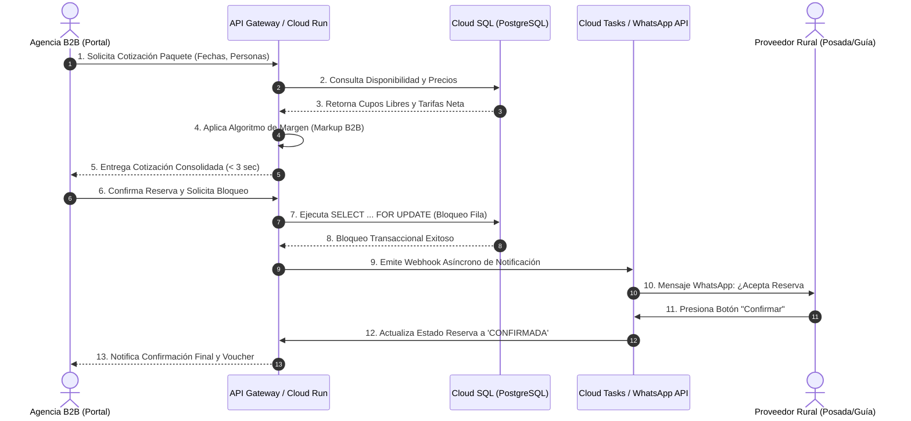
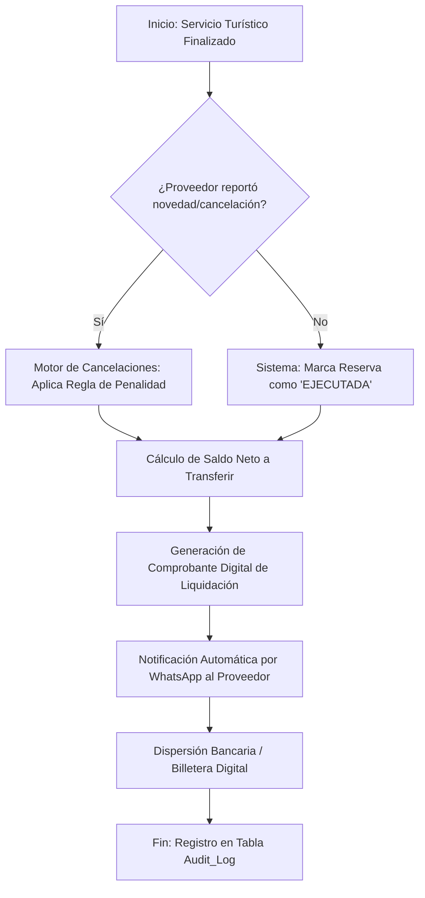
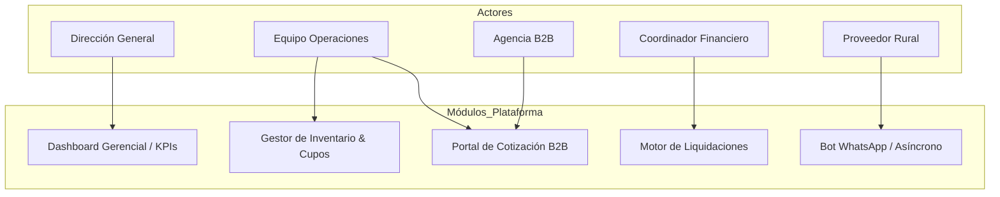

# RutaConecta S.A.S. — Fase B: Arquitectura de Negocio
## Documento Técnico Oficial (TOGAF ADM 10)

**Asignatura:** Arquitectura de Sistemas II  
**Profesor:** Oscar Dario Sanchez Perez  
**Institución:** Universidad Central — Facultad de Ingeniería y Ciencias Básicas  
**Código del Documento:** RAW-FB-2026-002  
**Fecha de Elaboración:** Septiembre de 2026  
**Integrantes (Grupo A):**  
- Juan Esteban Nocua Camacho  
- Juan Heredia  
- Santiago Peñaranda  
- Camila Aguado  

---

## Índice

1. [Contexto Estratégico, Reglas de Oro y Alcance Operativo (TOGAF Fase B)](#1-contexto-estratégico-reglas-de-oro-y-alcance-operativo-togaf-fase-b)
   - 1.1. [Los Módulos Clave dentro del Alcance del Proyecto](#11-los-módulos-clave-dentro-del-alcance-del-proyecto)
   - 1.2. [Cadenas de Valor Principales (Flujos de Valor)](#12-cadenas-de-valor-principales-flujos-de-valor)
2. [Catálogo de Procesos y Diagrama de Actores de Negocio](#2-catálogo-de-procesos-y-diagrama-de-actores-de-negocio)
   - 2.1. [Actores de Negocio y Responsabilidades](#21-actores-de-negocio-y-responsabilidades)
   - 2.2. [Catálogo Estructurado de Procesos de Negocio](#22-catálogo-estructurado-de-procesos-de-negocio)
   - 2.3. [Matriz de Roles y Responsabilidades Objetivo (RACI)](#23-matriz-de-roles-y-responsabilidades-objetivo-raci)
3. [Arquitectura Base (Baseline Architecture - AS-IS)](#3-arquitectura-base-baseline-architecture---as-is)
   - 3.1. [Diagnóstico del Estado Actual de Software, Datos y Operaciones](#31-diagnóstico-del-estado-actual-de-software-datos-y-operaciones)
4. [Arquitectura Destino (Target Architecture - TO-BE)](#4-arquitectura-destino-target-architecture---to-be)
   - 4.1. [Diseño de Capacidades y Reglas de Negocio TO-BE](#41-diseño-de-capacidades-y-reglas-de-negocio-to-be)
5. [Análisis de Brechas (Gap Analysis) — La Matriz de Brechas](#5-análisis-de-brechas-gap-analysis--la-matriz-de-brechas)
   - 5.1. [Matriz de Brechas Completa y Detallada para RutaConecta S.A.S.](#51-matriz-de-brechas-completa-y-detallada-para-rutaconecta-sas)
   - 5.2. [Impacto Organizacional y Gestión del Cambio Operativo](#52-impacto-organizacional-y-gestión-del-cambio-operativo)
6. [Diagramas de Arquitectura y Código para Draw.io / Mermaid](#6-diagramas-de-arquitectura-y-código-para-drawio--mermaid)
7. [Conclusiones, Trazabilidad hacia la Fase C y Plan de Acción](#7-conclusiones-trazabilidad-hacia-la-fase-c-y-plan-de-acción)
   - 7.1. [Matriz de Trazabilidad de Requisitos de Negocio](#71-matriz-de-trazabilidad-de-requisitos-de-negocio)
8. [Referencias (APA 7.ª Edición)](#8-referencias-apa-7ª-edición)

---

## 1. Contexto Estratégico, Reglas de Oro y Alcance Operativo (TOGAF Fase B)

El desarrollo de la **Arquitectura de Negocio (Fase B del método ADM de TOGAF)** representa el cimiento indispensable sobre el cual se articulan las soluciones tecnológicas posteriores (Fases C y D). En términos prácticos y de negocio, la tecnología no es un fin en sí misma; implementar herramientas sofisticadas sobre procesos deficientes o no entendidos únicamente acelera el caos operativo. La **"Regla de Oro"** expuesta en el marco TOGAF establece con claridad que las arquitecturas de datos, aplicaciones e infraestructura tecnológica fallan sistemáticamente cuando se construyen sin una comprensión rigurosa y validada de la realidad del negocio.

Para el caso de **RutaConecta S.A.S.** —un consolidador B2B de turismo rural y comunitario en Colombia—, esta fase de contexto busca delimitar el alcance operativo de la plataforma, formalizando la transición desde una operación artesanal y manual basada en archivos compartidos de Google Drive y mensajería informal, hacia un ecosistema digital elástico, automatizado y resiliente en Google Cloud Platform (GCP).

### 1.1. Los Módulos Clave dentro del Alcance del Proyecto

Con el propósito de dejar "sellado" el alcance de la transformación y evitar la desviación del proyecto (*scope creep*), la Fase B aborda y rediseña de manera directa los cuatro módulos operativos críticos de RutaConecta:

1. **Módulo de Inventarios y Disponibilidad Unificada (SSOT):** Consolidación de cupos de hospedaje comunitario (habitaciones) y transporte terrestre/marítimo (asientos en vans y lanchas). Reemplaza las hojas de cálculo dispersas por un repositorio relacional con concurrencia protegida.
2. **Motor de Cotización y Venta B2B Instantánea:** Automatización de reglas de precios, márgenes de intermediación (*markup*) y comisiones B2B, permitiendo a las agencias minoristas cotizar e independientemente confirmar paquetes consolidados en menos de 5 minutos.
3. **Canal de Integración e Inclusión Rural Asíncrona (Offline-First):** Interfaz liviana para proveedores locales en zonas con conectividad móvil limitada (2G/3G) apalancada en la API de WhatsApp Business y SMS, garantizando una adopción superior al 85% sin exigir la descarga de aplicaciones pesadas.
4. **Motor de Liquidación y Conciliación Financiera a Proveedores:** Motor automático de dispersión y cálculo de fondos que liquida tarifas netas a posaderos, guías y conductores en menos de 2 horas tras la ejecución del servicio, preservando los principios de Comercio Justo y transparencia.

---
### 1.2. Cadenas de Valor Principales (Flujos de Valor)

1. **VS-01: Captura de Demanda B2B a Reserva Confirmada**
   - **Propósito:** Recibir solicitudes de cotización de agencias minoristas, verificar disponibilidad multi-proveedor, bloquear cupos y confirmar la reserva de forma instantánea.
   - **Etapas:** Búsqueda de disponibilidad → Cotización consolidada → Bloqueo transaccional de cupo → Confirmación al cliente B2B → Notificación asíncrona al proveedor rural.

2. **VS-02: Prestación del Servicio Rural a Liquidación Automatizada**
   - **Propósito:** Asegurar la prestación efectiva del servicio turístico rural, validar el cumplimiento y ejecutar el pago neto transparente al proveedor local sin reprocesos manuales.
   - **Etapas:** Prestación del servicio en campo → Registro de conformidad / comprobante digital → Conciliación de tarifa neta y comisión → Dispersión / orden de liquidación → Emisión de soporte digital.

## 2. Catálogo de Procesos y Diagrama de Actores de Negocio

Para garantizar la trazabilidad entre las partes interesadas y los flujos operativos, se identifican y mapean los actores involucrados junto a sus responsabilidades en la arquitectura baseline (AS-IS) y la arquitectura destino (TO-BE).

### 2.1. Actores de Negocio y Responsabilidades

* **Dirección General (Sustentador Estratégico):** Sponsor del proyecto. Requiere escala operativa, visibilidad de rentabilidad en tiempo real y reducción de costos de personal administrativo.
* **Equipo de Operaciones (Usuarios Internos):** Ejecutores del proceso baseline. Encargados de gestionar reservas manuales, validar disponibilidad por llamadas telefónicas y atender discrepancias B2B.
* **Coordinador Financiero / Contabilidad:** Responsables de la conciliación de cartera, cálculo de comisiones y dispersión de pagos quincenales/mensuales a los prestadores de servicios.
* **Agencias de Viajes B2B (Clientes):** Clientes comerciales que demandan respuestas inmediatas (< 5 min), garantías contractuales de inventario y cero eventos de sobreventa (*overbooking*).
* **Proveedores Rurales (Socios Locales):** Aliados locales (posadas, guías, transportistas). Exigen pagos puntuales, liquidaciones transparentes e interfaces simples que funcionen bajo baja señal móvil.

### 2.2. Catálogo Estructurado de Procesos de Negocio

| Código | Nombre del Proceso | Estado AS-IS (Baseline) | Estado TO-BE (Destino) |
| :--- | :--- | :--- | :--- |
| **PROC-01** | **Registro y Actualización de Cupos** | Edición manual de celdas en hojas de Google Sheets sin control de cambios ni concurrencia. | Ingreso autónomo o asíncrono vía WhatsApp Bot con validación transaccional directa. |
| **PROC-02** | **Cotización Consolidada B2B** | Búsqueda en múltiples Excels y llamadas por teléfono. Tarda entre 24 y 48 horas. | Portal B2B de autoservicio que consulta la base de datos y cotiza en < 5 minutos. |
| **PROC-03** | **Bloqueo y Reserva de Inventario** | Confirmación verbal/chat. Genera overbooking (5-8%) por falta de concurrencia. | Bloqueo estricto a nivel de fila (`FOR UPDATE`) en base de datos ACID (0% overbooking). |
| **PROC-04** | **Notificación al Proveedor Rural** | Llamada telefónica o mensaje informal manual de WhatsApp. | Envío automático de webhook interactivo a WhatsApp con botones de confirmación. |
| **PROC-05** | **Liquidación y Conciliación Financiera** | Cruce manual al final del mes entre recibos de WhatsApp y tablas de Excel (5+ días). | Cálculo automático de comisiones y generación de soporte digital en < 2 horas. |
| **PROC-06** | **Gestión de Cancelaciones y Reembolsos** | Resolución ad-hoc por chat sin política estandarizada ni motor de reglas. | Motor de reglas de cancelación integrado que calcula penalidades y libera cupos en tiempo real. |

---
### 2.3. Matriz de Roles y Responsabilidades Objetivo (RACI)

| Proceso Objetivo (TO-BE) | Agencias B2B | Operaciones (Ruta) | Finanzas / Contab. | Proveedor Rural | Sistema Central |
| :--- | :---: | :---: | :---: | :---: | :---: |
| **Cotización y Autoconsulta B2B** | R | I | I | I | A |
| **Reserva y Bloqueo Anti-Sobreventa** | R | I | I | I | A |
| **Confirmación de Inventario Rural** | I | A | I | R | C |
| **Liquidación de Tarifas Netas** | I | C | A | I | R |
| **Auditoría y Gestión de Excepciones** | I | R / A | C | I | C |

*Leyenda:* **R** = Responsable (Ejecuta); **A** = Aprobador (Rinde cuentas); **C** = Consultado; **I** = Informado.

## 3. Arquitectura Base (Baseline Architecture - AS-IS)

La Arquitectura Baseline refleja la realidad operativa actual de RutaConecta, caracterizada por un nivel de madurez tecnológico 1.0 (Ad-hoc) según el modelo ACMM de TOGAF. La empresa no cuenta con un sistema de información a medida; su operación descansa sobre una "infraestructura improvisada" de hojas de cálculo interconectadas manualmente en Google Drive.

### 3.1. Diagnóstico del Estado Actual de Software, Datos y Operaciones

1. **Fragmentación de Datos e Inexistencia de Transaccionalidad:** Google Sheets no es una base de datos relacional. La carencia de propiedades ACID (Atomicidad, Consistencia, Aislamiento y Durabilidad) provoca que cuando dos analistas operativos abren la misma hoja de cálculo para reservar una habitación en Palomino o un asiento en una van hacia el Tayrona, ambos puedan sobrescribir la celda. Esto genera una tasa de *overbooking* del 5% al 8%, con sobrecostos superiores a $10.000.000 COP por evento en reubicaciones de emergencia e indemnizaciones.
2. **Latencia Comercial Extrema (24 a 48 Horas):** Para emitir una propuesta comercial a una agencia minorista B2B, el equipo de operaciones debe abrir hasta 5 archivos de Excel diferentes (tarifas de transporte, hospedaje, guías y márgenes) y realizar llamadas telefónicas para verificar si el proveedor rural no ha vendido el cupo por su cuenta. En un mercado altamente dinámico, esta demora provoca una tasa de abandono del cliente cercana al 85%.
3. **Saturación y Desgaste en la Conciliación Financiera:** A fin de mes, el coordinador contable debe revisar cientos de conversaciones de WhatsApp para verificar si un tour se realizó, se canceló o si el posadero recibió un anticipo. Este proceso manual tarda habitualmente más de 5 días hábiles, genera fricción con las comunidades locales por retrasos en los pagos y expone a la empresa a errores de digitación en las transferencias.

---

## 4. Arquitectura Destino (Target Architecture - TO-BE)

La Arquitectura Target proyecta la transformación integral de la operación hacia un modelo elástico, serverless y automatizado sobre Google Cloud Platform (GCP). En este estado futuro, la tecnología se alinea directamente con los objetivos estratégicos aprobados en la Fase A.

### 4.1. Diseño de Capacidades y Reglas de Negocio TO-BE

1. **Mecanismo de Bloqueo Transaccional (Cero Overbooking):** La capa de persistencia en Cloud SQL (PostgreSQL HA) implementa un control de concurrencia mediante bloqueos de fila (`SELECT ... FOR UPDATE`). Cuando una agencia inicia el proceso de cotización y reserva, el sistema bloquea temporalmente los cupos requeridos durante una ventana de 10 minutos. Es matemáticamente imposible vender la misma habitación o asiento dos veces.
2. **Motor de Reglas de Margen y Cotización Automática:** La lógica de negocio expuesta a través de Cloud Run ejecuta algoritmos paramétricos que cruzan las tarifas neta costo de los proveedores con los porcentajes de margen (*markup*) asignados a cada agencia B2B, consolidando la cotización en un tiempo de respuesta menor a 3 segundos.
3. **Integración Rural Asíncrona (Offline-First via WhatsApp API):** Para salvar la barrera de baja conectividad en zonas rurales, el sistema utiliza un esquema asíncrono. Cuando se genera una reserva, Cloud Tasks programa un mensaje interactivo de WhatsApp al teléfono del proveedor rural. Si el prestador no tiene señal en ese momento, el mensaje se entrega tan pronto el dispositivo recupera cobertura, permitiendo confirmar o rechazar con un solo botón.
4. **Motor de Liquidación y Dispersión Automatizada:** Al finalizar cada servicio, el sistema genera automáticamente el borrador de liquidación cruzando la reserva confirmada contra la tarifa pactada. Se calcula la retención, la comisión de RutaConecta y el saldo neto a transferir, emitiendo una notificación de pago en menos de 2 horas.

---

## 5. Análisis de Brechas (Gap Analysis) — La Matriz de Brechas

El Análisis de Brechas constituye la herramienta analítica central de la Fase B de TOGAF. Su propósito es comparar sistemáticamente la Arquitectura Baseline (AS-IS) contra la Arquitectura Target (TO-BE), clasificando cada componente o capacidad en una de las cuatro categorías estandarizadas: **Retenido**, **Eliminado**, **Modificado** o **Nuevo**.

### 5.1. Matriz de Brechas Completa y Detallada para RutaConecta S.A.S.

| Capacidad / Proceso | Estado AS-IS (Baseline) | Estado TO-BE (Destino) | Categoría | Acción Requerida / Impacto Operativo |
| :--- | :--- | :--- | :---: | :--- |
| **Red de Alianzas y Comercio Justo** | Alianzas comerciales activas con posadas, guías y agencias B2B. | Red comercial expandida operando sobre plataforma digital. | **RETENIDO** | Conservar intacta la estrategia de relacionamiento, los contratos de tarifa costo y los principios éticos de comercio justo. |
| **Gestión de Inventario en Drive / Excel** | Uso de archivos Google Sheets compartidos editados a mano sin concurrencia. | Repositorio relacional centralizado (Cloud SQL PostgreSQL HA). | **ELIMINADO** | Desmantelar completamente las hojas de cálculo como base de datos de producción. Migrar datos históricos y congelar edición en Drive. |
| **Cotización y Venta B2B** | Proceso manual vía teléfono y correo con latencia de 24 a 48 horas. | Portal Web B2B de autoservicio con cotización en < 5 minutos. | **MODIFICADO** | Rediseñar el flujo operativo. La agencia interactúa de forma autónoma con el portal web y el motor de reglas calcula tarifas. |
| **Liquidación a Proveedores** | Conciliación mensual manual cruzando chats de WhatsApp y Excel (5 días). | Cálculo y pre-liquidación automática en < 2 horas post-servicio. | **MODIFICADO** | Estandarizar fórmulas de comisión en backend y automatizar la generación de soportes digitales de dispersión. |
| **Bloqueo Transaccional de Cupos** | Inexistente. Genera un 5-8% de overbooking por colisión de reservas. | Mecanismo de bloqueo con consistencia ACID (Row-Level Locking). | **NUEVO** | Desarrollar lógica transaccional `FOR UPDATE` en la base de datos para garantizar 0% de sobreventa sobre inventario confirmado. |
| **Canal Rural Asíncrono (WhatsApp Bot)** | Llamadas telefónicas e instrucciones informales por chat uno a uno. | Webhook conversacional asíncrono con WhatsApp Business API. | **NUEVO** | Implementar integración Serverless (Cloud Functions + Cloud Tasks) para enviar notificaciones e interactuar con proveedores rurales offline. |
| **Motor de Cancelaciones y Reembolsos** | Gestión ad-hoc caso a caso por WhatsApp sin política uniforme. | Motor de reglas parametrizado según políticas de anticipación. | **NUEVO** | Codificar lógica de penalidades automáticas, devolución proporcional y liberación inmediata de cupos al inventario general. |

---
## 5.2. Impacto Organizacional y Gestión del Cambio Operativo

### Evolución de Roles y Reestructuración de Personal
La automatización de las tareas repetitivas busca reorientar el talento humano de tareas operativas de bajo valor hacia actividades de supervisión analítica y crecimiento del negocio:

| Rol Actual (AS-IS) | Rol Evolucionado (TO-BE) | Nuevas Funciones y Enfoque Estratégico |
| :--- | :--- | :--- |
| **Asistente de Cotizaciones Manuales** | Gestor de Excepciones y Servicio al Cliente B2B | Monitorear casos complejos, resolver disputas y brindar atención de alto valor a agencias clave. |
| **Auxiliar de Verificación Telefónica** | Analista de Desarrollo Rural y Calidad de Proveedores | Trabajo de campo: Capacitar a nuevos posaderos, afiliar servicios turísticos y auditar estándares de calidad. |
| **Auxiliar Contable de Conciliación** | Analista de Rentabilidad y Liquidación Automática | Analizar tableros de control en Looker Studio, monitorear márgenes netos por canal y supervisar dispersiones de dinero. |

### Estrategia de Adopción e Inclusión Rural (Enfoque Prioritario en WhatsApp)[cite: 6]
1. **Cero Curva de Aprendizaje:** Interacción exclusiva a través de WhatsApp Business API y SMS sin requerir descarga de aplicaciones pesadas ni creación de contraseñas complejas[cite: 6].
2. **Tolerancia a Conectividad Nula (Diseño Fuera de Línea):** Notificaciones encoladas en GCP (mediante Pub/Sub / Cloud Tasks) que se entregan automáticamente cuando el dispositivo recupera cobertura móvil (2G/3G)[cite: 6].
3. **Incentivos a la Disponibilidad:** Algoritmo de posicionamiento prioritario en búsquedas B2B para proveedores que mantengan su inventario actualizado de forma autónoma[cite: 6].
4. **Despliegue Piloto Progresivo:** Fase de pruebas de 4 semanas con un grupo focal de 5 posadas y 2 agencias B2B aliadas antes del corte definitivo del sistema[cite: 6].

## 6. Diagramas de Arquitectura y Código para Draw.io / Mermaid

A continuación se incluyen cuatro diagramas modelados en sintaxis ejecutable **Mermaid**, acompañados de su representación gráfica conceptual ASCII y su guía de construcción para herramientas como Draw.io o Bizagi.

### Diagrama 1: Mapa de Flujo de Valor (Value Stream Map)

```mermaid
graph LR
    A[Agencia B2B: Solicitud de Cotización] --> B[Motor API: Validación de Inventario SSOT]
    B --> C[Motor de Reglas: Cotización y Margen < 5 min]
    C --> D[Agencia B2B: Confirmación y Reserva]
    D --> E[Base de Datos: Bloqueo ACID FOR UPDATE]
    E --> F[WhatsApp API: Notificación Asíncrona a Posada/Guía]
    F --> G[Proveedor Rural: Confirmación de Cupo]
    G --> H[Ejecución del Servicio Turístico]
    H --> I[Backend: Liquidación Automática < 2 h]
    I --> J[Finanzas: Transferencia y Comercio Justo]
```

#### Representación Conceptual:

---

### Diagrama 2: Modelo de Procesos BPMN TO-BE (Cotización, Reserva y Bloqueo Transaccional)

---

### Diagrama 3: Modelo de Procesos BPMN TO-BE (Liquidación y Conciliación Financiera)

---

### Diagrama 4: Diagrama de Actores y Roles (Matriz RBAC)

---

## 7. Conclusiones, Trazabilidad hacia la Fase C y Plan de Acción

## 7.1.Matriz de Trazabilidad de Requisitos de Negocio

| Código BR | Requisito de Negocio | Proceso Objetivo Asociado | Capacidad de Negocio de Soporte | Métrica / Indicador de Verificación |
| :--- | :--- | :--- | :--- | :--- |
| **BR-01** | Soportar 3 veces el volumen de reservas sin aumento proporcional de personal. | PROC-TOBE-01 / PROC-TOBE-02 | Gestión de Inventarios y Cupos / Motor de Cotización | Reducción del 60% en el costo operativo por reserva. |
| **BR-02** | Generar reportes gerenciales de margen por agencia y proveedor. | PROC-TOBE-04 | Inteligencia de Precios y Márgenes | Reportes ejecutivos en tiempo real en Looker Studio. |
| **BR-03** | Cotización consolidada automática en menos de 5 minutos. | PROC-TOBE-01 | Motor de Cotización B2B | Tiempo de respuesta menor a 3 segundos ($p_{95}$). |
| **BR-04** | Panel único de disponibilidad en tiempo real (Fuente Única de Verdad). | PROC-TOBE-02 | Sincronización de Inventarios | 100% de los datos en Cloud (0 hojas de cálculo). |
| **BR-05** | Motor de liquidación con cálculo automático de tarifa neta y comisión. | PROC-TOBE-04 | Liquidación a Proveedores | Tiempo de dispersión menor a 2 horas tras la prestación del servicio. |
| **BR-06** | Conciliación de servicios prestados frente a lo facturado sin cruces manuales. | PROC-TOBE-04 | Gestión Financiera y Contable | 0% de discrepancias en liquidaciones financieras. |
| **BR-07** | Portal de autoservicio para agencias B2B con confirmación inmediata. | PROC-TOBE-01 / PROC-TOBE-02 | Portal de Autoservicio B2B | Incremento de la tasa de conversión B2B a más del 35%. |
| **BR-08** | Garantía contractual de cero sobreventa sobre cupos confirmados. | PROC-TOBE-02 | Bloqueo Transaccional Anti-Sobreventa | Tasa de sobreventa = 0% absoluto. |
| **BR-09** | Confirmación o rechazo de reservas por WhatsApp/SMS sin aplicaciones pesadas. | PROC-TOBE-03 | Canal e Inclusión Rural | Adopción rural por parte de proveedores mayor al 85%. |
| **BR-10** | Notificación de liquidación con soporte digital descargable. | PROC-TOBE-03 / PROC-TOBE-04 | Inclusión Rural / Liquidación | Comprobantes digitales adjuntos mediante WhatsApp o correo electrónico. |

La ejecución de la **Fase B (Arquitectura de Negocio)** permite cerrar de manera formal la brecha entre las aspiraciones comerciales de RutaConecta y su implementación tecnológica. La Matriz de Brechas desarrollada constituye el insumo directo para el diseño de la **Fase C (Arquitectura de Datos y Aplicaciones)**, dictando los siguientes requerimientos técnicos obligatorios:

1. El diseño del **Modelo Entidad-Relación** debe estructurar entidades para `Proveedor`, `Hospedaje`, `Vehiculo`, `Cupo_Diario`, `Cotizacion`, `Reserva`, `Detalle_Reserva` y `Liquidacion`, con restricciones de clave foránea e índices transaccionales.
2. Las aplicaciones backend deben implementarse como servicios desacoplados en **Cloud Run** exponiendo contratos de API RESTful documentados en OpenAPI 3.0.
3. El canal rural debe construirse utilizando **Cloud Functions** conectadas a la API de WhatsApp Business mediante Webhooks asíncronos gestionados por colas de mensajería **Cloud Pub/Sub**.

---

## 8. Referencias (APA 7.ª Edición)

* Congreso de Colombia. (2012). *Ley 1581 de 2012, por la cual se dictan disposiciones generales para la protección de datos personales*. Diario Oficial No. 48.587.
* International Organization for Standardization. (2011). *ISO/IEC 25010:2011 — Systems and software engineering — Systems and software Quality Requirements and Evaluation (SQuaRE) — System and software quality models*.
* RutaConecta S.A.S. (2026). *RutaConecta_FaseA_Documento_Tecnico.md — Documento Técnico de Visión de Arquitectura (TOGAF ADM 10)*. Repositorio Institucional.
* Sánchez Pérez, O. D. (2026). *Sesión 10 — TOGAF Fase B: Arquitectura de Negocio*. Presentación de clase, Asignatura Arquitectura de Sistemas II, Universidad Central.
* The Open Group. (2018). *The TOGAF® Standard, Version 9.2 — Phase B: Business Architecture*. Open Group Standard.
