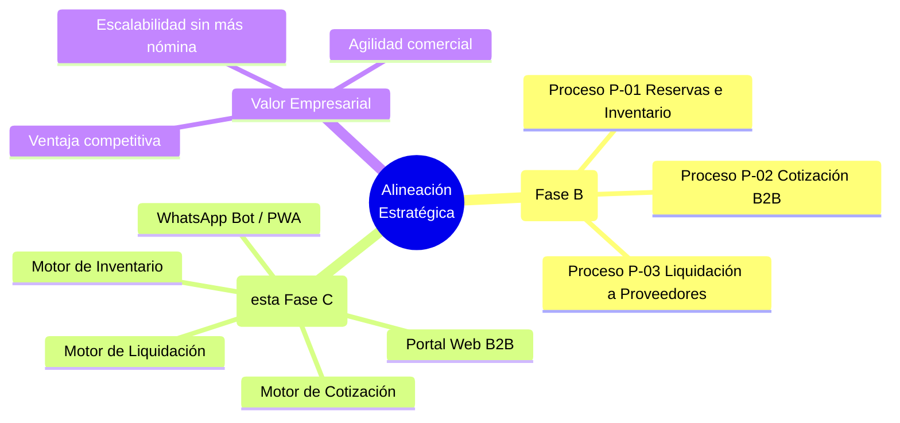
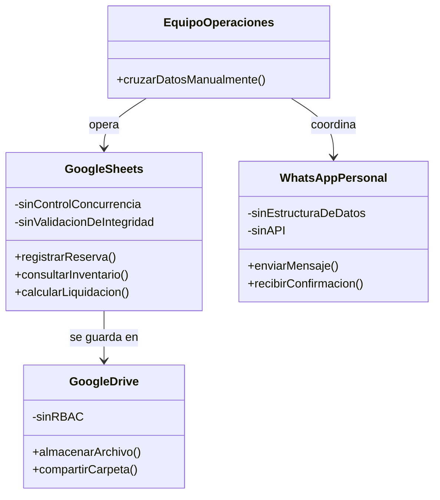
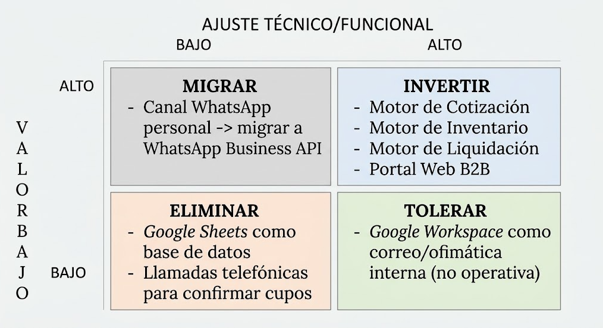
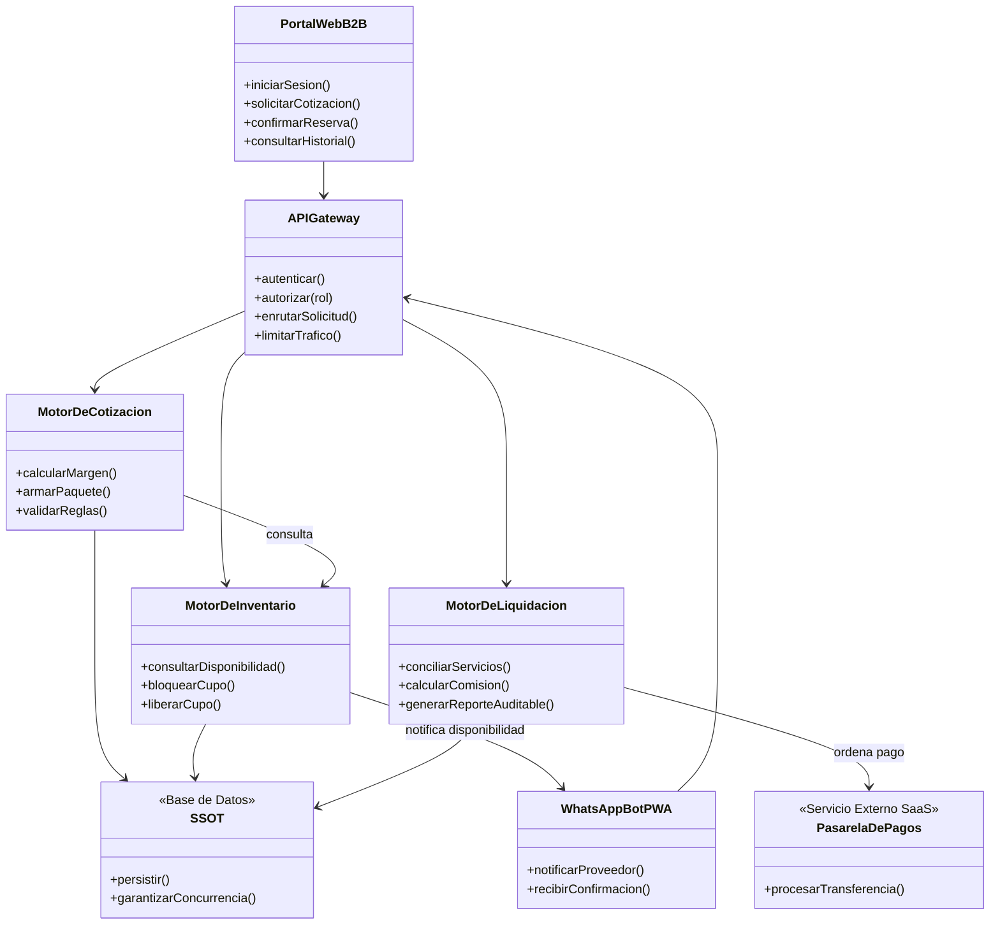
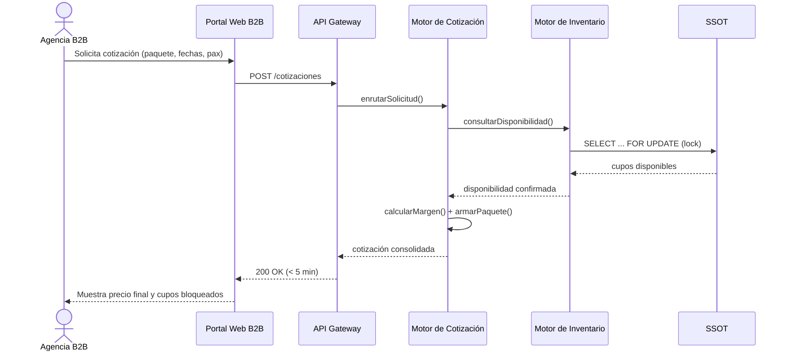
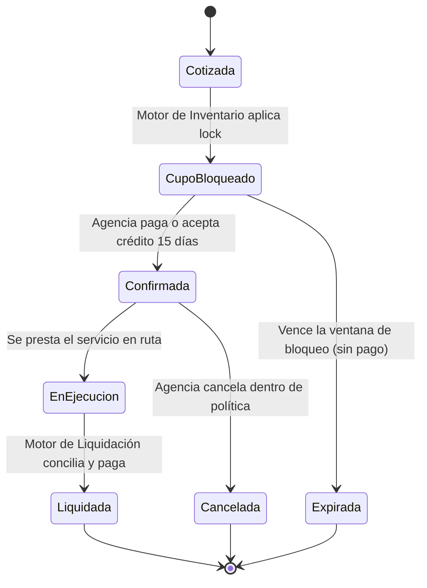
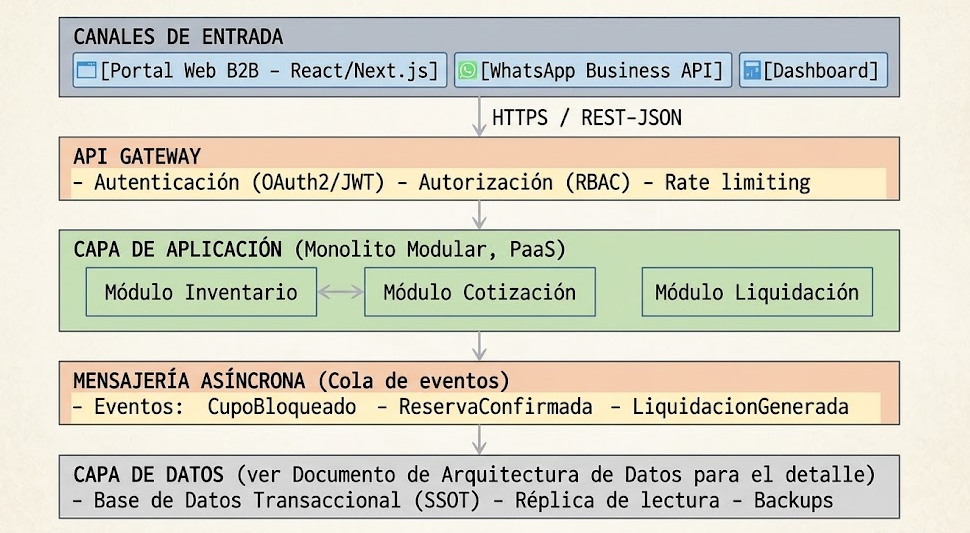
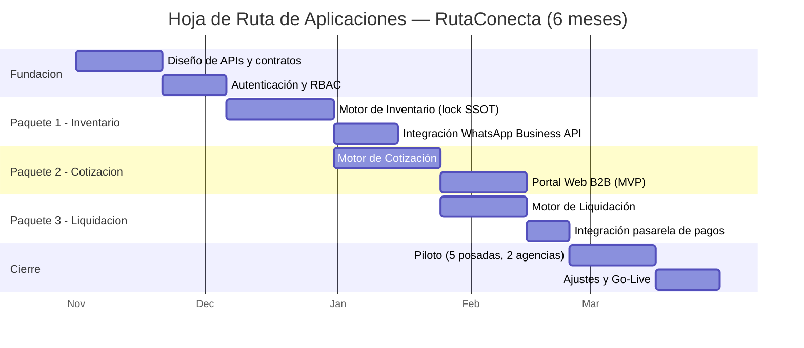

# RutaConecta S.A.S. — Fase C: Arquitectura de Sistemas de Información
## Documento Técnico — Arquitectura de Aplicaciones (Software)

**Asignatura:** Arquitectura de Sistemas II
**Universidad Central**
**Profesor:** Oscar Darío Sánchez Pérez
**Integrantes:** Juan Heredia, Santiago Peñaranda, Camila Aguado, Juan Nocua
**Empresa objeto de estudio (ficticia):** RutaConecta S.A.S. — Consolidador B2B de Turismo Rural y Comunitario
**Código del documento:** RAW-FC-SW-2026-001
**Fases previas cerradas:** Preliminar, Fase A (Visión) y Fase B (Arquitectura de Negocio)
**Versión:** 1.0

---

## Índice

1. Qué es la Fase C y por qué la partimos en dos documentos
2. Alineación Estratégica: de la Fase B a las Aplicaciones
3. Arquitectura de Aplicaciones Base (AS-IS)
4. Modelos de Evaluación del Portafolio de Aplicaciones
5. Arquitectura de Aplicaciones Objetivo (TO-BE)
6. Estrategia Comprar vs. Desarrollar (Buy vs. Build)
7. Agilidad Empresarial: el Verdadero Objetivo de la Fase C
8. Análisis de Brechas (Gap Analysis) de Aplicaciones
9. Paquetes de Trabajo y Hoja de Ruta de Implementación
10. Rol del Arquitecto en esta Fase
11. Conclusiones
12. Glosario
13. Referencias (APA 7.ª edición)

---

## 1. Qué es la Fase C y por qué la partimos en dos documentos

La Fase C del ADM de TOGAF en realidad no es una fase, son dos trabajando codo a codo: Arquitectura de Datos y Arquitectura de Aplicaciones, y el estándar deja abierto el orden en que se abordan (The Open Group, 2018a). Como el profesor nos lo explicó en la Sesión de Fase C, la idea no es diseñar "una app", sino construir el mapa completo del ecosistema de software que soporta los procesos que ya modelamos en la Fase B, y dejar claro qué información fluye por ese ecosistema.

Por eso entregamos **dos documentos separados pero hermanos**: este es el de **Arquitectura de Aplicaciones (Software)**, y hay un segundo documento dedicado a la **Arquitectura de Datos**. Se leen mejor por separado porque cada uno responde preguntas distintas —este documento responde "¿qué construimos o compramos, y cómo se comunican esos sistemas entre sí?"—, pero comparten el mismo AS-IS de negocio (Fase B) y se citan mutuamente donde hace falta.

---

## 2. Alineación Estratégica: de la Fase B a las Aplicaciones

Como bien lo remarcó el profesor: la arquitectura de aplicaciones tiene que servir directamente a la Arquitectura de Negocio que ya definimos en la Fase B. Si no hay esa alineación, la tecnología deja de ser motor de la transformación y se convierte en un estorbo más.

Cada componente de software que proponemos en este documento existe **porque** resuelve un proceso de negocio específico de la Fase B, nunca al revés. Si en algún punto alguien propone una aplicación que no se pueda trazar hasta un proceso P-01, P-02 o P-03 (o hasta un principio de la Fase Preliminar), esa aplicación no tiene por qué estar en el alcance.

---

## 3. Arquitectura de Aplicaciones Base (AS-IS)

Hoy en día RutaConecta no tiene "aplicaciones" en el sentido estricto de la palabra. Lo que existe es una malla de herramientas ofimáticas genéricas que el equipo fuerza a hacer un trabajo que no fue diseñado para hacer.

### 3.1. Inventario de Aplicaciones AS-IS

| Aplicación / Herramienta | Tipo | Función que cumple hoy | Problema principal |
|---|---|---|---|
| Google Sheets (Excel en Drive) | Ofimática genérica (SaaS) | Registro de inventario, tarifas, reservas y liquidaciones | No es transaccional; no soporta concurrencia; es la causa raíz del overbooking |
| WhatsApp (personal) | Mensajería genérica (SaaS) | Confirmación de cupos y coordinación con proveedores | Canal informal, sin trazabilidad, sin estructura de datos |
| Google Drive | Almacenamiento genérico (SaaS) | Repositorio de archivos compartidos | No tiene control de versiones transaccional ni permisos granulares (RBAC) |
| Llamadas telefónicas | N/A | Verificación de disponibilidad en tiempo real | No deja registro; depende de la disponibilidad humana |

### 3.2. Componentes de Software AS-IS

**Lectura rápida:** ninguno de estos "componentes" fue diseñado para ser parte de un sistema de información empresarial; son herramientas de productividad personal que el Equipo de Operaciones está forzando a comportarse como un sistema transaccional, y por eso fallan justo donde más se necesitan: concurrencia, trazabilidad y control de acceso.

---

## 4. Modelos de Evaluación del Portafolio de Aplicaciones

Tal como lo vimos en la Sesión de Fase C, antes de diseñar el TO-BE hay que mirar el portafolio de aplicaciones desde cuatro perspectivas distintas. Aplicamos las cuatro a RutaConecta:

| Modelo | Pregunta que responde | Aplicado a RutaConecta |
|---|---|---|
| **Modelo de Desarrollo** | ¿Lo construimos, lo compramos o integramos algo ya existente? | Los tres motores (Inventario, Cotización, Liquidación) se desarrollan a la medida porque son el corazón diferenciador; la pasarela de pagos y el canal de WhatsApp se compran/integran como servicios ya existentes. |
| **Modelo Funcional** | ¿Qué aplicaciones consumen recursos sin generar valor? | Google Sheets y las llamadas telefónicas consumen horas-hombre del Equipo de Operaciones sin generar ninguna ventaja competitiva; son candidatas directas a eliminación. |
| **Modelo de Integración** | ¿Qué tan rígidas o flexibles son las interfaces entre sistemas? | Hoy la "integración" es 100% manual (una persona copiando datos entre Excel y WhatsApp); el TO-BE exige APIs RESTful documentadas (Principio 7 de la Fase Preliminar). |
| **Modelo de Producto** | ¿Qué aplicación genera diferenciación real en el mercado? | El Motor de Cotización es el activo de mayor valor competitivo: es lo que le permite a RutaConecta responder en minutos cuando la competencia tarda días. |

### 4.1. Matriz de Portafolio (Gartner TIME) — Comprar vs. Construir vs. Eliminar

El modelo TIME (Tolerar, Invertir, Migrar, Eliminar) de Gartner es un estándar de la industria para clasificar cada aplicación de un portafolio según su ajuste técnico y su valor de negocio (LeanIX, n.d.). Ubicamos ahí las piezas de RutaConecta:

*(Diagrama en ASCII a propósito: es una matriz de posicionamiento con etiquetas libres, así que te va a rendir más armarla visualmente en Draw.io o PowerPoint que forzarla en Mermaid.)*

---

## 5. Arquitectura de Aplicaciones Objetivo (TO-BE)

### 5.1. Componentes de la Plataforma TO-BE

### 5.2. Secuencia de Interacción — Cotización B2B en Menos de 5 Minutos

Esta es la joya de la corona del TO-BE: la secuencia que reemplaza las 24-48 horas actuales.

### 5.3. Ciclo de Vida de una Reserva (Máquina de Estados)

> Esta máquina de estados es, en el fondo, la especificación funcional que le vamos a entregar al Arquitecto de Software para que programe el Motor de Inventario y el Motor de Cotización: cada flecha es una transición que el código tiene que saber ejecutar y validar.

### 5.4. Arquitectura Física / Despliegue

Igual que en la Fase A, este diagrama de capas conviene dibujarlo en Draw.io con más detalle visual; aquí va la referencia textual completa para que no se pierda ningún componente:

---

## 6. Estrategia Comprar vs. Desarrollar (Buy vs. Build)

El dilema estratégico de esta fase es simple de enunciar y difícil de resolver: qué componentes se adquieren como producto estándar y cuáles se desarrollan internamente para generar ventaja competitiva.

| Componente | Decisión | Justificación |
|---|---|---|
| Motor de Cotización | **Construir (Build)** | Es la ventaja competitiva real de RutaConecta; ningún SaaS genérico conoce las reglas de negocio específicas de turismo rural B2B |
| Motor de Inventario | **Construir (Build)** | El control de concurrencia sobre cupos rurales es un requisito muy específico (Escenario de Calidad 3, Fase A) |
| Motor de Liquidación | **Construir (Build)** | Las reglas de comisión y comercio justo (Principio 1) son propias del negocio |
| Pasarela de Pagos | **Comprar (Buy)** | Bold/Wompi ya resuelven esto de forma segura y regulada; reinventarlo sería un riesgo legal y de seguridad innecesario |
| Canal de mensajería con proveedores | **Comprar/Integrar** | WhatsApp Business API (Meta, 2024) ya es el estándar de facto para inclusión digital rural en Latinoamérica |
| Autenticación y RBAC | **Comprar/Integrar** | Servicios de identidad gestionados (IDaaS) reducen drásticamente el riesgo de seguridad frente a construir uno propio |
| Hosting e infraestructura | **Comprar (PaaS)** | Coherente con el Principio 4 (Fase Preliminar): simplicidad operativa sobre arquitecturas sobre-diseñadas |

Esta tabla, en el fondo, es la aplicación práctica del Modelo de Desarrollo que vimos en la sección 4: construir solo lo que diferencia, comprar todo lo demás.

---

## 7. Agilidad Empresarial: el Verdadero Objetivo de la Fase C

Como lo aclaró el profesor, la agilidad de negocio no es escribir código más rápido; es diseñar una arquitectura que reduzca las barreras organizacionales y tecnológicas. Cuatro principios guían esto en RutaConecta:

1. **Eliminar silos:** hoy Operaciones, Finanzas y los proveedores viven en mundos de información separados (Excel de un lado, WhatsApp del otro). La SSOT y las APIs rompen esos silos.
2. **Interfaces estándar:** cada motor expone una API RESTful documentada (Principio 7), así que un cambio interno en el Motor de Liquidación no obliga a tocar el Portal Web.
3. **Modularidad:** el diseño Monolítico Modular (Principio 4) permite reemplazar, por ejemplo, el Motor de Cotización en el futuro sin reescribir todo el sistema.
4. **Capacidad de reacción:** si mañana RutaConecta quiere vender un cuarto tipo de servicio (por ejemplo, alquiler de equipos), el patrón de módulos ya definido reduce el tiempo de desarrollo de meses a semanas.

---

## 8. Análisis de Brechas (Gap Analysis) de Aplicaciones

| Aplicación / Componente | AS-IS | TO-BE | Acción |
|---|---|---|---|
| Sistema de registro de inventario | Google Sheets | Motor de Inventario a la medida | **Nuevo** (elimina Sheets) |
| Cálculo de cotizaciones | Cálculo manual en plantilla | Motor de Cotización con reglas automatizadas | **Nuevo** |
| Cálculo de liquidaciones | Cruce manual Excel/WhatsApp | Motor de Liquidación con conciliación automática | **Nuevo** |
| Canal con proveedores | WhatsApp personal | WhatsApp Business API + PWA | **Migrado** |
| Canal con agencias B2B | Correo/WhatsApp + PDF | Portal Web B2B de autoservicio | **Nuevo** |
| Autenticación | Ninguna (acceso libre a Drive) | OAuth2/JWT + RBAC | **Nuevo** |
| Procesamiento de pagos | Transferencia manual | Integración con pasarela (Bold/Wompi) | **Nuevo** (comprado) |
| Panel gerencial | Ninguno | Dashboard con indicadores en tiempo real | **Nuevo** |

Estas ocho brechas son, en esencia, la traducción a "aplicaciones concretas" de la Matriz de Brechas de negocio que ya cerramos en la Fase B; cada fila de esta tabla resuelve una o más filas de aquella matriz.

---

## 9. Paquetes de Trabajo y Hoja de Ruta de Implementación

Siguiendo la lógica de entregables de la Fase C (Arquitectura Objetivo, Paquetes de Trabajo y Hoja de Ruta), agrupamos el desarrollo en unidades de implementación priorizadas:

**Paquetes de trabajo (Work Packages):**

1. **PT-01 Fundación técnica:** contratos de API, autenticación/RBAC — habilita todo lo demás.
2. **PT-02 Inventario:** Motor de Inventario + integración WhatsApp Business API — ataca el overbooking.
3. **PT-03 Cotización:** Motor de Cotización + Portal Web B2B — ataca la latencia de 24-48h.
4. **PT-04 Liquidación:** Motor de Liquidación + pasarela de pagos — ataca la fricción financiera.
5. **PT-05 Piloto y cierre:** despliegue controlado con 5 posadas y 2 agencias antes del lanzamiento masivo (ya comprometido desde la Fase A).

---

## 10. Rol del Arquitecto en esta Fase

| Rol | Enfoque en esta fase |
|---|---|
| **Arquitecto de Software** | Define los patrones de diseño (Monolito Modular), los estándares de desarrollo, las arquitecturas de referencia de cada motor y gestiona el portafolio de aplicaciones descrito en la sección 4. |
| **Arquitecto Empresarial (Principal)** | Verifica que cada decisión de esta fase siga alineada con el valor de negocio de la Fase B, sirve de puente entre el Arquitecto de Software y el Arquitecto de Datos, y aprueba los trade-offs de Comprar vs. Construir. |

---

## 11. Conclusiones

Con este documento, RutaConecta pasa de tener una intención de transformación (Fases Preliminar, A y B) a tener un **plano concreto de qué software construir, qué software comprar, y en qué orden**. Los tres motores (Inventario, Cotización, Liquidación) son las piezas que materializan cada uno de los tres procesos de negocio de la Fase B, y el Portal Web y el WhatsApp Bot son los canales que finalmente le dan la cara al cliente y al proveedor rural.

El siguiente paso es el documento hermano de **Arquitectura de Datos**, que define el modelo exacto de la SSOT sobre el que trabajan estos mismos componentes, y después la **Fase D (Arquitectura Tecnológica)**, donde se decide en qué nube y con qué topología física corre todo esto.

---

## 12. Glosario

- **ADM:** Architecture Development Method, el método cíclico de TOGAF.
- **API Gateway:** componente que centraliza autenticación, autorización y enrutamiento de solicitudes hacia los servicios internos.
- **Buy vs. Build:** decisión estratégica entre comprar software estándar o desarrollarlo a la medida.
- **Monolito Modular:** estilo arquitectónico donde la aplicación se despliega como una unidad, pero internamente está dividida en módulos con responsabilidades claras.
- **PaaS/SaaS:** Platform/Software as a Service, servicios de nube administrados.
- **RBAC:** Role-Based Access Control, control de acceso basado en roles.
- **REST/RESTful:** estilo arquitectónico para servicios web basado en recursos y verbos HTTP (Fielding, 2000).
- **SSOT:** Single Source of Truth, repositorio único y autoritativo de datos (se detalla en el documento de Arquitectura de Datos).
- **TIME (Gartner):** modelo de clasificación de portafolio de aplicaciones en Tolerar, Invertir, Migrar o Eliminar.
- **Work Package (Paquete de Trabajo):** unidad de implementación priorizada dentro de la hoja de ruta de arquitectura.

## 13. Referencias (APA 7.ª edición)

Fielding, R. T. (2000). *Architectural styles and the design of network-based software architectures* [Tesis doctoral, University of California, Irvine]. https://www.ics.uci.edu/~fielding/pubs/dissertation/top.htm

LeanIX. (n.d.). *Assess application portfolio with Gartner® TIME framework*. Recuperado en septiembre de 2026, de https://www.leanix.net/en/wiki/ea/gartner-time-model

Meta. (2024). *WhatsApp Business Platform — Documentation*. https://developers.facebook.com/docs/whatsapp

The Open Group. (2018a). *The TOGAF® Standard, Version 9.2 — Phase C: Information Systems Architectures*. https://pubs.opengroup.org/architecture/togaf9-doc/arch/chap09.html

The Open Group. (2018b). *The TOGAF® Standard, Version 9.2*. https://www.opengroup.org/togaf-standard-version-92-overview

*(Ver referencias adicionales de Ley 1581 de 2012, RGPD e ISO/IEC 25010 en el Documento Integrado de Fases Preliminar/A/B, dado que aplican transversalmente a todo el proyecto.)*
