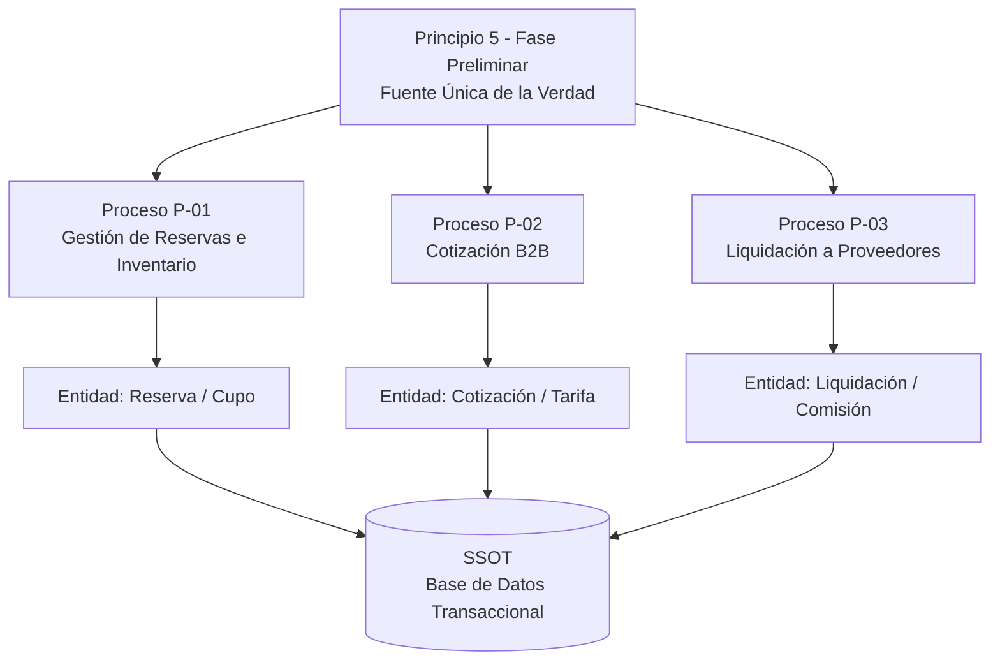
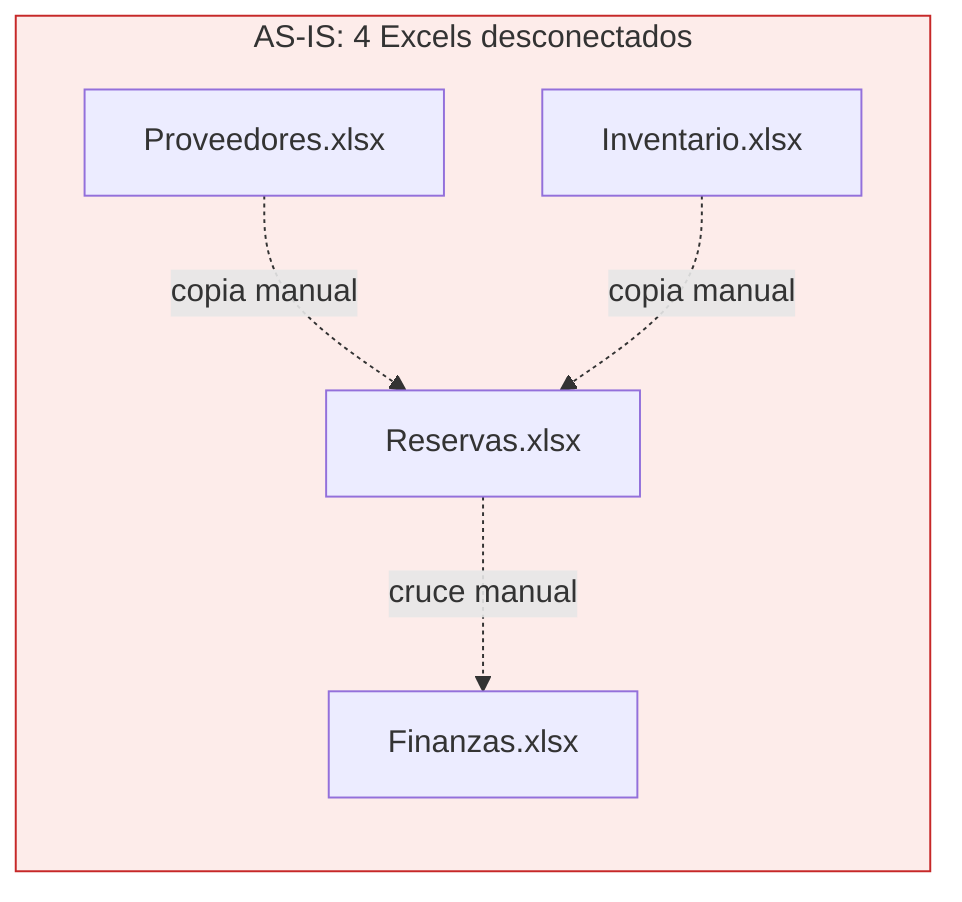
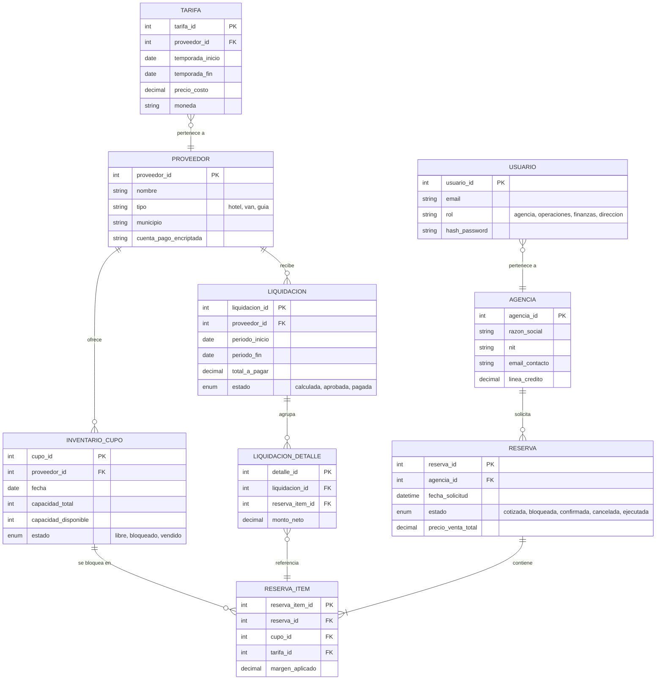
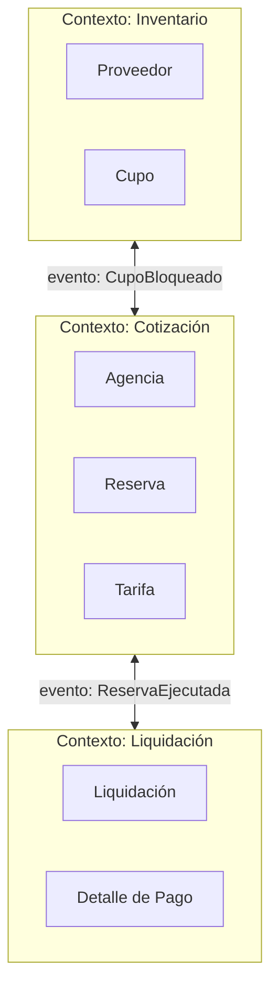
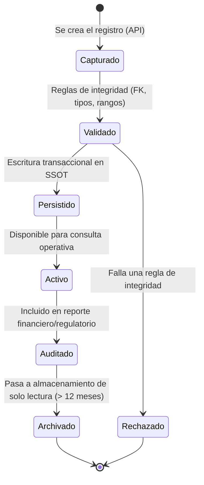
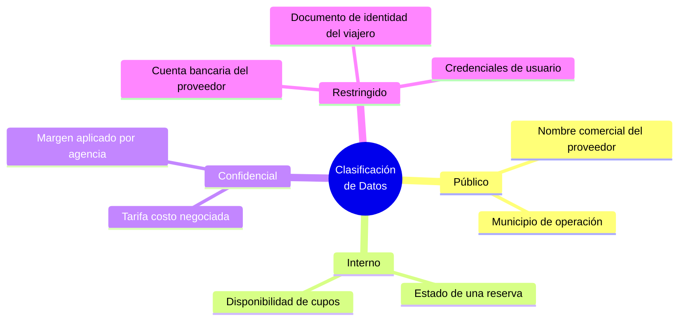
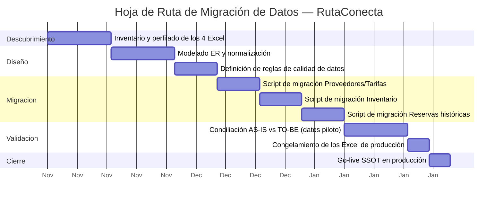

# RutaConecta S.A.S. — Fase C: Arquitectura de Sistemas de Información
## Documento Técnico — Arquitectura de Datos

**Asignatura:** Arquitectura de Sistemas II
**Universidad Central**
**Profesor:** Oscar Darío Sánchez Pérez
**Integrantes:** Juan Heredia, Santiago Peñaranda, Camila Aguado, Juan Nocua
**Empresa objeto de estudio (ficticia):** RutaConecta S.A.S. — Consolidador B2B de Turismo Rural y Comunitario
**Código del documento:** RAW-FC-DATA-2026-001
**Fases previas cerradas:** Preliminar, Fase A (Visión) y Fase B (Arquitectura de Negocio)
**Documento hermano:** RAW-FC-SW-2026-001 (Arquitectura de Aplicaciones)
**Versión:** 1.0

---

## Índice

1. Qué cubre este documento dentro de la Fase C
2. Alineación con la Arquitectura de Negocio (Fase B)
3. Arquitectura de Datos Base (AS-IS)
4. Principios de Arquitectura de Datos Aplicados
5. Arquitectura de Datos Objetivo (TO-BE): Modelo Entidad-Relación
6. Modelo Conceptual de Dominio (Bounded Contexts)
7. Ciclo de Vida del Dato
8. Clasificación y Gobierno de Datos
9. Análisis de Brechas (Gap Analysis) de Datos
10. Estrategia de Migración y Hoja de Ruta
11. Rol del Arquitecto de Datos
12. Conclusiones
13. Glosario
14. Referencias (APA 7.ª edición)

---

## 1. Qué cubre este documento dentro de la Fase C

Este es el segundo de los dos documentos de la Fase C de TOGAF. El primero (RAW-FC-SW-2026-001) resuelve el "qué software construimos o compramos"; este resuelve una pregunta distinta y, para RutaConecta, más urgente todavía: **¿dónde vive el dato, cómo se estructura y quién puede tocarlo?** El estándar de TOGAF trata la Arquitectura de Datos como un desarrollo independiente dentro de la Fase C, con sus propios objetivos, pasos y entregables (The Open Group, 2018a), así que este documento sigue esa misma lógica en vez de mezclarse con el de aplicaciones.

Si el documento de software es el "cómo se mueve la información", este es el "qué es la información y en qué forma vive". Son inseparables en la práctica, pero se documentan distinto porque los responsables y las decisiones técnicas son distintas: aquí manda el Arquitecto de Datos, no el Arquitecto de Software.

---

## 2. Alineación con la Arquitectura de Negocio (Fase B)

El Principio 5 que ya aprobamos desde la Fase Preliminar —Fuente Única de la Verdad (SSOT)— es, en el fondo, el mandato que le da origen a todo este documento: prohibimos las hojas de cálculo como base de datos de producción, y ahora toca diseñar qué las reemplaza.

Cada entidad de datos que se propone en la sección 5 nace de un proceso de negocio real de la Fase B, no de una idea abstracta de "qué tablas se ven bien".

---

## 3. Arquitectura de Datos Base (AS-IS)

### 3.1. Inventario de Fuentes de Datos Actuales

| Fuente de datos | Contenido | Formato | Problema de fondo |
|---|---|---|---|
| `Proveedores_y_Contratos/` (Drive) | Tarifas por temporada, datos de contacto, cuentas bancarias | Hojas de Excel sueltas | Sin esquema, sin validación de tipos, cuentas bancarias en texto plano |
| `Inventario_y_Disponibilidad/` (Drive) | Cupos de habitaciones/asientos por fecha | Excel general del mes | Se actualiza manualmente al recibir un WhatsApp; sin control de concurrencia |
| `Reservas_y_Cotizaciones/` (Drive) | Paquetes cotizados, estado de reserva | Un archivo por cliente/agencia | Sin relación formal con el inventario; duplicidad de información |
| `Finanzas_y_Liquidaciones/` (Drive) | Cierre mensual de pagos a proveedores | Matriz de Excel | Cálculo manual, sin trazabilidad, sin historial versionado |

### 3.2. Por qué esto es, en términos de Codd, un desastre de diseño

Ninguna de estas cuatro "tablas" cumple ni la primera forma normal en el sentido estricto: hay grupos repetidos, no hay llaves primarias reales, y una misma tarifa puede estar escrita en dos archivos distintos con dos valores distintos. Codd (1970) diseñó la normalización precisamente para eliminar anomalías de inserción, actualización y eliminación — las tres anomalías que hoy le explotan a RutaConecta cada fin de mes cuando alguien actualiza el Excel de tarifas pero se le olvida actualizar el de cotizaciones.

---

## 4. Principios de Arquitectura de Datos Aplicados

Retomamos de la Fase Preliminar los principios que gobiernan específicamente el diseño de datos:

| Principio | Aplicación concreta en el modelo de datos |
|---|---|
| P2 — Privacidad por Diseño | Los campos de documento de identidad, pasaporte y cuenta bancaria se cifran en reposo (AES-256) y se separan en tablas con acceso restringido |
| P3 — Confidencialidad B2B | Ninguna agencia puede hacer *join* contra la tarifa costo de otra agencia; se aísla lógicamente por `agencia_id` en cada consulta |
| P5 — Fuente Única de la Verdad | Todas las entidades viven en un único motor relacional; se elimina cualquier copia local |
| P7 — Interoperabilidad por APIs | El acceso a los datos solo ocurre a través de los Motores (ver documento de Aplicaciones), nunca por conexión directa de un tercero a la base de datos |

Y, adicionalmente, aplicamos un principio propio de esta fase:

**Principio de Datos 8 — Trazabilidad Financiera Total.** Toda fila de la tabla de liquidaciones debe poder reconstruirse hasta la reserva y el servicio que la originó, sin excepciones, porque el Principio 1 (Comercio Justo) exige auditar cada centavo pagado a un proveedor rural.

---

## 5. Arquitectura de Datos Objetivo (TO-BE): Modelo Entidad-Relación

Este es el corazón del documento: el modelo relacional que reemplaza los cuatro Excel.

**Notas de diseño clave:**

- `RESERVA_ITEM` es la tabla que materializa el bloqueo transaccional (lock) del Escenario de Calidad 3 de la Fase A: cada fila referencia un `cupo_id` específico, y la base de datos aplica bloqueo a nivel de fila para evitar que dos agencias reserven el mismo cupo al mismo tiempo (PostgreSQL Global Development Group, 2024).
- `TARIFA` está separada de `RESERVA_ITEM` a propósito: así, cuando cambie una tarifa futura, no se altera el precio ya pactado en una reserva histórica (esto es, ni más ni menos, evitar la anomalía de actualización que describía Codd, 1970).
- El campo `cuenta_pago_encriptada` en `PROVEEDOR` es el que materializa el Principio 2 de Privacidad por Diseño.

---

## 6. Modelo Conceptual de Dominio (Bounded Contexts)

Más allá de las tablas, conviene pensar el dominio en los tres "mundos" de negocio que ya identificamos en la Fase B, siguiendo la lógica de contextos delimitados de Evans (2003):

**Por qué separamos así el dominio:** cada contexto tiene su propio "idioma". Para el contexto de Inventario, un "cupo" es una unidad física (una cama, un puesto en la van); para el contexto de Cotización, ese mismo cupo es una línea de precio dentro de un paquete. Modelarlos como bounded contexts distintos (aunque compartan la misma base de datos física) evita que una regla de negocio de un área contamine a la otra — es exactamente el tipo de acoplamiento que el Principio 7 (Interoperabilidad por APIs) busca prevenir.

---

## 7. Ciclo de Vida del Dato

No todos los datos envejecen igual. Una reserva activa necesita consultas rapidísimas; una liquidación de hace tres años solo necesita existir para una auditoría.

Este ciclo de vida es el que sustenta el requisito de retención de logs de auditoría de mínimo 12 meses que ya habíamos comprometido en la Fase A (Escenario de Calidad 5 — Seguridad), en línea con las buenas prácticas de trazabilidad de datos personales de la Ley 1581 de 2012 (Congreso de Colombia, 2012).

---

## 8. Clasificación y Gobierno de Datos

| Nivel | Ejemplos | Control aplicado |
|---|---|---|
| Público | Nombre comercial, municipio | Sin restricción |
| Interno | Estado de reserva, disponibilidad | Acceso autenticado (cualquier rol interno) |
| Confidencial | Tarifa costo, márgenes | RBAC estricto; aislado por `agencia_id`/`proveedor_id` (Principio 3) |
| Restringido | Cuentas bancarias, documentos de identidad | Cifrado en reposo y en tránsito; acceso solo para el Motor de Liquidación y el rol Finanzas (Principio 2) |

Esta tabla es, en la práctica, la política de gobierno de datos que el Arquitecto de Datos debe hacer cumplir en cada script de migración y en cada nuevo campo que alguien quiera agregar al modelo.

---

## 9. Análisis de Brechas (Gap Analysis) de Datos

| Elemento | AS-IS | TO-BE | Categoría |
|---|---|---|---|
| Modelo de datos | Inexistente (hojas sueltas) | Modelo relacional normalizado (sección 5) | **Nuevo** |
| Control de concurrencia | Ninguno (edición simultánea sin bloqueo) | Bloqueo a nivel de fila (row-level locking) | **Nuevo** |
| Integridad referencial | Ninguna (copiar y pegar entre archivos) | Llaves foráneas + restricciones a nivel de motor de BD | **Nuevo** |
| Cifrado de datos sensibles | Ninguno (texto plano en Excel) | AES-256 en reposo, TLS en tránsito | **Nuevo** |
| Control de acceso a datos | Ninguno (cualquiera con el link de Drive) | RBAC por rol y por entidad (agencia/proveedor) | **Nuevo** |
| Histórico de tarifas | Se sobrescribe (se pierde el histórico) | Tabla `TARIFA` versionada por temporada | **Nuevo** |
| Trazabilidad de liquidaciones | Nula (cálculo manual sin registro) | `LIQUIDACION_DETALLE` referencia cada reserva | **Nuevo** |
| Retención y archivado | No existe política | Ciclo de vida formal (sección 7), archivado a 12 meses | **Nuevo** |

Aquí prácticamente todo es "Nuevo" porque, para efectos de datos, RutaConecta parte de cero: no hay nada que "modificar" en un Excel, hay que construir el modelo desde los cimientos.

---

## 10. Estrategia de Migración y Hoja de Ruta

**Puntos críticos de la migración:**

1. **No hay "big bang":** los cuatro Excel se migran en el orden que menos dependencias rompe (Proveedores/Tarifas primero, porque todo lo demás depende de ellos).
2. **Conciliación obligatoria antes de apagar Excel:** durante el piloto (5 posadas, 2 agencias, ya comprometido desde la Fase A), el sistema nuevo corre en paralelo al Excel para comparar resultados antes del corte definitivo.
3. **Responsable:** el Arquitecto de Datos valida cada script de migración contra las reglas de integridad de la sección 5 antes de dar el visto bueno para el `Go-live`.

---

## 11. Rol del Arquitecto de Datos

| Responsabilidad | Detalle en RutaConecta |
|---|---|
| Diseño del modelo relacional | Autor y responsable de mantener actualizado el diagrama de la sección 5 |
| Gobierno de calidad de datos | Define y audita las reglas de validación del ciclo de vida (sección 7) |
| Migración desde el legado | Diseña y ejecuta los scripts de migración de la sección 10 |
| Cumplimiento normativo | Garantiza que el modelo cumple la Ley 1581 de 2012 y las buenas prácticas del RGPD para los datos de viajeros y proveedores |
| Puente con el Arquitecto de Software | Define el contrato de datos (esquema, tipos, restricciones) que consumen los Motores del documento de Aplicaciones |

---

## 12. Conclusiones

Con este documento, la Fuente Única de la Verdad deja de ser un principio abstracto de la Fase Preliminar y pasa a tener nombre, apellido y tipo de dato: ocho entidades relacionadas, un ciclo de vida claro y una clasificación de sensibilidad que le dice a cualquier desarrollador exactamente qué campos cifrar y a quién dejar ver qué. La normalización aplicada (Codd, 1970) resuelve de raíz las anomalías que hoy le cuestan tiempo y plata a RutaConecta cada fin de mes.

El siguiente paso natural es la **Fase D (Arquitectura Tecnológica)**, donde se decide en qué motor de base de datos específico y con qué topología de nube corre este modelo — información que ya está anticipada en el documento hermano de Aplicaciones, pero que se formaliza allá.

---

## 13. Glosario

- **Bounded Context (Contexto Delimitado):** frontera explícita dentro de la cual un modelo de dominio tiene un significado consistente (Evans, 2003).
- **Cifrado en reposo / en tránsito:** protección criptográfica de los datos almacenados y de los datos que viajan por la red, respectivamente.
- **Forma Normal:** conjunto de reglas para estructurar tablas relacionales y evitar redundancia (Codd, 1970).
- **Llave Foránea (FK):** campo que referencia la llave primaria de otra tabla, garantizando integridad referencial.
- **Row-Level Locking (bloqueo a nivel de fila):** mecanismo de control de concurrencia que impide que dos transacciones modifiquen la misma fila al mismo tiempo.
- **RBAC:** Role-Based Access Control, control de acceso basado en roles.
- **SSOT:** Single Source of Truth, repositorio único y autoritativo de datos.

## 14. Referencias (APA 7.ª edición)

Codd, E. F. (1970). A relational model of data for large shared data banks. *Communications of the ACM*, *13*(6), 377–387. https://doi.org/10.1145/362384.362685

Congreso de Colombia. (2012). *Ley 1581 de 2012, por la cual se dictan disposiciones generales para la protección de datos personales*. Diario Oficial No. 48.587. https://www.funcionpublica.gov.co/eva/gestornormativo/norma.php?i=49981

Evans, E. (2003). *Domain-driven design: Tackling complexity in the heart of software*. Addison-Wesley.

PostgreSQL Global Development Group. (2024). *PostgreSQL 16 documentation — Chapter 13: Concurrency control*. https://www.postgresql.org/docs/current/mvcc.html

The Open Group. (2018a). *The TOGAF® Standard, Version 9.2 — Phase C: Information Systems Architectures — Data Architecture*. https://pubs.opengroup.org/architecture/togaf9-doc/arch/chap09.html

The Open Group. (2018b). *The TOGAF® Standard, Version 9.2*. https://www.opengroup.org/togaf-standard-version-92-overview

*(Ver referencias adicionales de RGPD e ISO/IEC 25010 en el Documento Integrado de Fases Preliminar/A/B, dado que aplican transversalmente a todo el proyecto.)*
